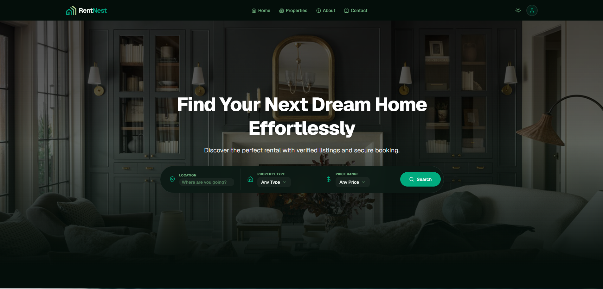

# 🏠 RentNest — Modern House & Property Rental System

**RentNest** is a full-stack, production-ready house and property rental application built using Next.js 15 (App Router), TypeScript, Tailwind CSS, Shadcn UI, and Stripe Payment Gateway. It seamlessly connects Tenants with Landlords for hassle-free property listings, booking requests, and secure online rental transactions.

---

## 🖼️ Home Page Preview



> *The RentNest homepage featuring a hero search bar, featured property listings, and role-based call-to-action sections.*

---

## 🔗 Live Links & Repositories

| Resource          | URL                                                        |
| ----------------- | ---------------------------------------------------------- |
| **Live Frontend** | [https://rent-nest-00.vercel.app](https://rent-nest-00.vercel.app) |
| **Live Backend**  | [https://rent-nest-backend.vercel.app](https://rent-nest-backend.vercel.app) |
| **Frontend Repo** | [https://github.com/mehedihasanrafi205/RentNest](https://github.com/mehedihasanrafi205/RentNest) |
| **Backend Repo**  | [https://github.com/mehedihasanrafi205/RentNest-backend](https://github.com/mehedihasanrafi205/RentNest-backend) |

---

## 🧪 Test Credentials

```
Admin Email    : admin@rentnest.com
Admin Password : admin123
```

> You can also register a new account as a **Tenant** or **Landlord** from the `/register` page.

---

## ✨ Key Features

### 🏘️ Public Pages
- **Home** — Hero section with search bar, featured properties, role-based CTA, and "Why Choose Us" section
- **Properties** — Browse all available properties with search & filter (search term, property type, min/max price)
- **Property Details** — Full property view with images, amenities, pricing, and booking button
- **About** — Company vision, stats, mission, how-it-works (tenants & landlords), team section
- **Contact** — Contact form and company information

### 🔐 Authentication
- **Login** — Email/password login with JWT token stored in httpOnly cookies
- **Register** — Sign up as **Tenant** or **Landlord** with role selection
- **Logout** — Clears auth cookies and revalidates cache
- Split-screen auth layout with branded hero section on desktop

### 👤 Tenant Dashboard
- **Overview** — Stats cards (total bookings, pending, approved, payments made)
- **My Bookings** — View all booking requests with status filter tabs (ALL, PENDING, APPROVED, REJECTED)
- **Payments** — Stripe checkout for approved bookings, payment history with transaction IDs
- **Reviews** — Submit ratings (1-5 stars) and comments for approved rental properties

### 🏠 Landlord Dashboard
- **Overview** — Stats cards (total properties, total requests, pending, approved)
- **My Properties** — Table view of listings with "Add Property" dialog (title, description, location, price, amenities, image URL)
- **Booking Requests** — Approve or reject incoming tenant booking requests
- **Tenant History** — View all rental history for landlord's properties

### 👑 Admin Dashboard
- **Overview** — Platform-wide stats (total users, properties, rentals, revenue)
- **Manage Users** — View all users, ban/unban users (except admins)
- **Manage Properties** — View all listings, delete properties, view property details

### 💳 Payment System
- **Stripe Checkout** — Secure card payments for approved bookings
- **Webhook Handler** — Backend Stripe webhook to confirm payments automatically
- **Success/Cancel Pages** — User-friendly payment result pages with navigation links
- **Payment History** — Transaction records with property details and amounts

### 🎨 UI/UX
- **Dark/Light Mode** — Theme toggle with `next-themes` (system preference detection)
- **Responsive Design** — Mobile-first with off-canvas drawer navigation
- **Animations** — Framer Motion powered transitions and scroll animations
- **Toast Notifications** — Sonner toasts for all user actions (success, error, confirmation)
- **Skeleton Loading** — Loading states for property cards and data fetching
- **Error Handling** — Global error boundary (`error.tsx`), 404 page (`not-found.tsx`), loading state (`loading.tsx`)

---

## 🛠️ Tech Stack

### Frontend

| Technology         | Version  | Purpose                          |
| ------------------ | -------- | -------------------------------- |
| **Next.js**        | 16.2.6   | React framework (App Router)     |
| **React**          | 19.2.4   | UI library                       |
| **TypeScript**     | ^5       | Type safety                      |
| **Tailwind CSS**   | ^4       | Utility-first styling            |
| **shadcn/ui**      | ^4.15.0  | Headless UI components           |
| **Radix UI**       | ^1.6.7   | Accessible primitives            |
| **Framer Motion**  | ^12.42.2 | Animations                       |
| **next-themes**    | ^0.4.6   | Dark/light mode                  |
| **Sonner**         | ^2.0.7   | Toast notifications              |
| **Lucide React**   | ^1.27.0  | Icon library                     |
| **canvas-confetti**| ^1.9.4   | Celebration effects              |
| **pnpm**           | —        | Package manager                  |

### Backend

| Technology         | Version  | Purpose                          |
| ------------------ | -------- | -------------------------------- |
| **Express**        | 5.2.1    | Web framework                    |
| **TypeScript**     | ^6.0.3   | Type safety                      |
| **Prisma**         | 7.8.0    | ORM (PostgreSQL adapter)         |
| **PostgreSQL**     | —        | Database                         |
| **JWT**            | ^9.0.3   | Authentication tokens            |
| **Bcrypt**         | ^6.0.0   | Password hashing                 |
| **Stripe**         | ^22.3.0  | Payment gateway                  |
| **Zod**            | ^4.4.3   | Request validation               |
| **CORS**           | ^2.8.6   | Cross-origin resource sharing    |
| **cookie-parser**  | ^1.4.7   | Cookie parsing                   |
| **tsup**           | ^8.5.1   | Build tool                       |
| **Vercel**         | —        | Deployment platform              |

---

## 📦 Project Structure

### Frontend Structure

```
RentNest/
├── app/
│   ├── (auth)/                    # Authentication route group
│   │   ├── _action/
│   │   │   └── auth.ts            # loginAction, registerAction, logoutAction
│   │   ├── _components/
│   │   │   ├── AuthHeroSection.tsx
│   │   │   ├── LoginForm.tsx
│   │   │   └── RegisterForm.tsx
│   │   ├── login/
│   │   ├── register/
│   │   └── layout.tsx
│   │
│   ├── (public)/                  # Public route group
│   │   ├── _action/
│   │   │   ├── createBookingAction.ts
│   │   │   ├── getAllProperties.ts
│   │   │   └── getIndividualProperty.ts
│   │   ├── _components/
│   │   │   ├── home/              # HeroSection, FeaturedProperties, RoleCtaSection, WhyChooseUs
│   │   │   └── properties/        # AllProperties, PropertiesCard, PropertiesSearchBar, BookingButton
│   │   ├── about/
│   │   ├── contact/
│   │   ├── properties/
│   │   │   ├── page.tsx           # All properties listing
│   │   │   └── [id]/page.tsx      # Single property detail
│   │   ├── layout.tsx             # Navbar + Footer
│   │   └── page.tsx               # Home page
│   │
│   ├── dashboard/                 # Protected dashboard area
│   │   ├── _action/
│   │   │   ├── admin/adminActions.ts
│   │   │   ├── landlord/landlordActions.ts
│   │   │   └── tenant/
│   │   │       ├── myBookingsAction.ts
│   │   │       ├── paymentActions.ts
│   │   │       └── reviewActions.ts
│   │   ├── _components/
│   │   │   ├── Sidebar.tsx
│   │   │   ├── ThemeToggle.tsx
│   │   │   ├── admin/             # AdminUsersTable, AdminPropertiesTable
│   │   │   ├── landlord/          # LandlordPropertiesTable, LandlordRequestsTable, LandlordTenantsTable
│   │   │   └── tenant/            # BookingsView, BookingCard, PaymentsView, PaymentCard, ReviewsView
│   │   ├── admin/                 # Admin dashboard pages
│   │   ├── landlord/              # Landlord dashboard pages
│   │   ├── tenant/                # Tenant dashboard pages
│   │   ├── layout.tsx             # Dashboard shell (sidebar + topbar)
│   │   └── page.tsx               # Dashboard redirect
│   │
│   ├── payments/
│   │   ├── success/page.tsx       # Stripe payment success
│   │   └── cancel/page.tsx        # Stripe payment cancel
│   │
│   ├── error.tsx                  # Global error boundary
│   ├── globals.css                # Global styles + Tailwind
│   ├── layout.tsx                 # Root layout (ThemeProvider, Toaster)
│   ├── loading.tsx                # Global loading state
│   └── not-found.tsx              # 404 page
│
├── components/
│   ├── shared/                    # Navbar.tsx, Footer.tsx
│   ├── ui/                        # shadcn/ui components
│   └── theme-provider.tsx
│
├── service/
│   └── getme.ts                   # Server action: fetch current user
│
├── types/
│   └── index.ts                   # All TypeScript interfaces & types
│
├── lib/
│   └── utils.ts                   # cn() utility (clsx + tailwind-merge)
│
├── proxy.ts                       # Next.js middleware (JWT decode + RBAC)
├── next.config.ts
├── package.json
└── tsconfig.json
```

### Backend Structure

```
RentNest-backend/
├── src/
│   ├── app.ts                     # Express app setup (CORS, routes, middleware)
│   ├── server.ts                  # Server entry point
│   ├── config/
│   │   └── index.ts               # Environment config
│   ├── lib/
│   │   └── prisma.ts              # Prisma client instance
│   ├── middlewares/
│   │   ├── auth.ts                # JWT auth + RBAC middleware
│   │   ├── globalErrorHandler.ts
│   │   ├── notFound.ts
│   │   └── validateRequest.ts     # Zod validation middleware
│   ├── models/
│   │   ├── auth/                  # register, login
│   │   ├── user/                  # profile, all users, ban/unban
│   │   ├── property/              # CRUD, filter, search
│   │   ├── booking/               # create, tenant/landlord bookings, status update
│   │   ├── payment/               # Stripe checkout, webhook, payment history
│   │   ├── category/              # CRUD (admin only)
│   │   └── review/                # create review, get reviews
│   └── utils/
│       ├── catchAsync.ts          # Async error wrapper
│       ├── jwt.ts                 # JWT create/verify
│       └── sendResponse.ts        # Unified API response
│
├── prisma/
│   ├── schema/                    # Prisma schema files
│   │   ├── schema.prisma          # Generator + datasource
│   │   ├── user.prisma
│   │   ├── property.prisma
│   │   ├── booking.prisma
│   │   ├── payment.prisma
│   │   ├── category.prisma
│   │   ├── review.prisma
│   │   └── enums.prisma           # UserRole, PropertyStatus, BookingStatus, PaymentStatus
│   └── migrations/                # Database migrations
│
├── generated/prisma/              # Prisma generated client
├── vercel.json
├── tsup.config.ts
└── package.json
```

---

## ⚙️ Environment Variables

### Frontend (`.env.local`)

```env
BACKEND_API_URL=https://rent-nest-backend.vercel.app
# Or for local backend:
# BACKEND_API_URL=http://localhost:5000/api

# Optional: if using a different public API URL
NEXT_PUBLIC_BASE_API=https://rent-nest-backend.vercel.app/api
```

### Backend (`.env`)

```env
# Database
DATABASE_URL=postgresql://<user>:<password>@<host>:<port>/<dbname>

# Server
PORT=5000
ENV=production
APP_URL=https://rent-nest-00.vercel.app

# JWT
JWT_ACCESS_SECRET=your_access_secret_here
JWT_REFRESH_SECRET=your_refresh_secret_here
JWT_ACCESS_EXPIRES_IN=1d
JWT_REFRESH_EXPIRES_IN=365d

# Bcrypt
BCRYPT_SALT_ROUNDS=12

# Stripe
STRIPE_SECRET_KEY=sk_test_your_stripe_secret_key
STRIPE_WEBHOOK_SECRET=whsec_your_webhook_secret
STRIPE_PRODUCT_PRICE_ID=price_your_price_id
```

---

## 🚀 Getting Started

### Prerequisites

- **Node.js** >= 18
- **pnpm** (install: `npm install -g pnpm`)
- **PostgreSQL** database (local or cloud)

### Frontend Setup

```bash
# 1. Clone the repository
git clone https://github.com/mehedihasanrafi205/RentNest.git
cd RentNest

# 2. Install dependencies
pnpm install

# 3. Create environment file
cp .env.example .env.local
# Edit .env.local with your backend API URL

# 4. Run development server
pnpm dev

# 5. Open http://localhost:3000
```

### Backend Setup

```bash
# 1. Clone the backend repository
git clone https://github.com/mehedihasanrafi205/RentNest-backend.git
cd RentNest-backend

# 2. Install dependencies
npm install

# 3. Create environment file
cp .env.example .env
# Edit .env with your database URL, JWT secrets, and Stripe keys

# 4. Run Prisma migrations
npx prisma migrate dev

# 5. Generate Prisma client
npx prisma generate

# 6. Run development server
npm run dev

# 7. API will be available at http://localhost:5000
```

### Available Scripts

#### Frontend

| Script             | Description                    |
| ------------------ | ------------------------------ |
| `pnpm dev`         | Start dev server               |
| `pnpm build`       | Production build               |
| `pnpm start`       | Start production server        |
| `pnpm lint`        | Run ESLint                     |
| `pnpm format`      | Format with Prettier           |
| `pnpm typecheck`   | TypeScript type checking       |

#### Backend

| Script             | Description                    |
| ------------------ | ------------------------------ |
| `npm run dev`      | Start dev server (tsx watch)   |
| `npm run build`    | Build with tsup                |
| `npm start`        | Start production server        |
| `npm run stripe:webhook` | Start Stripe webhook listener |

---

## 🔐 Authentication & Security

### How It Works

1. **Registration** — User submits `name`, `email`, `password`, `role` (TENANT/LANDLORD) → Backend hashes password with bcrypt → Returns user data (no password)
2. **Login** — User submits `email`, `password` → Backend verifies credentials → Generates JWT access token → Token stored in **httpOnly cookie** (secure in production, sameSite: lax)
3. **Protected Routes** — Middleware (`proxy.ts`) decodes JWT on Edge Runtime (no secret needed) → Checks `role` and `exp` → Redirects unauthorized users
4. **API Requests** — Server actions read `accessToken` from cookies → Send as `Authorization: Bearer <token>` header to backend
5. **Logout** — Clears `accessToken` and `refreshToken` cookies → Revalidates `my-profile` cache tag

### Security Features

- ✅ **httpOnly cookies** — Tokens not accessible via JavaScript
- ✅ **Secure cookies** — In production environment
- ✅ **Bcrypt password hashing** — Salt rounds configurable
- ✅ **JWT expiration check** — Edge runtime validates token expiry
- ✅ **Banned user check** — Backend middleware checks `isBanned` status
- ✅ **RBAC** — Role-based access control on both frontend and backend
- ✅ **Zod validation** — All backend requests validated with Zod schemas
- ✅ **CORS** — Configured with credentials for frontend origin only

---

## 🛣️ Route Protection (RBAC)

The middleware (`proxy.ts`) handles route protection with the following logic:

| Route Pattern              | Protection              | Redirect Logic                          |
| -------------------------- | ----------------------- | --------------------------------------- |
| `/login`, `/register`      | Redirect if logged in   | Role-based dashboard redirect           |
| `/dashboard/tenant/*`      | Requires `TENANT` role  | Others → `/`                            |
| `/dashboard/landlord/*`    | Requires `LANDLORD` role| Others → `/`                            |
| `/dashboard/admin/*`       | Requires `ADMIN` role   | Others → `/`                            |
| All other protected routes | Requires valid JWT      | Unauthenticated → `/login?redirectTo=…` |

**Public routes** (no auth required): `/`, `/properties`, `/about`, `/contact`, `/terms`, `/privacy`

---

## 📡 API Endpoints

### Base URL

```
https://rent-nest-backend.vercel.app/api
```

### Authentication

| Method | Endpoint          | Auth | Description                          |
| ------ | ----------------- | ---- | ------------------------------------ |
| `POST` | `/auth/register`  | ❌   | Register new user (TENANT/LANDLORD)  |
| `POST` | `/auth/login`     | ❌   | Login & receive JWT access token     |

### Users

| Method | Endpoint            | Auth         | Description                    |
| ------ | ------------------- | ------------ | ------------------------------ |
| `GET`  | `/users/me`         | All roles    | Get current user profile       |
| `PATCH`| `/users/update-me`  | All roles    | Update own profile (name)      |
| `GET`  | `/users`            | ADMIN        | Get all registered users       |
| `PATCH`| `/users/:id/status` | ADMIN        | Ban/unban a user               |

### Properties

| Method | Endpoint              | Auth      | Description                              |
| ------ | --------------------- | --------- | ---------------------------------------- |
| `GET`  | `/properties`         | ❌        | Get all properties (with filters)        |
| `GET`  | `/properties/:id`     | ❌        | Get single property details              |
| `POST` | `/properties/create-listing` | LANDLORD | Create new property listing       |

**Query Parameters for `/properties`:**
- `search` — Search by title/description (case-insensitive)
- `location` — Filter by location (case-insensitive)
- `minPrice` — Minimum price filter
- `maxPrice` — Maximum price filter
- `categoryId` — Filter by category
- `amenities` — Comma-separated amenities (e.g., "Wifi,Parking")

### Bookings

| Method  | Endpoint                      | Auth      | Description                        |
| ------- | ----------------------------- | --------- | ---------------------------------- |
| `POST`  | `/bookings/book-property`     | TENANT    | Create booking request             |
| `GET`   | `/bookings/my-bookings`       | TENANT    | Get tenant's bookings              |
| `GET`   | `/bookings/landlord-requests` | LANDLORD  | Get landlord's incoming requests   |
| `PATCH` | `/bookings/:id/update-status` | LANDLORD  | Approve/Reject booking request     |
| `GET`   | `/bookings`                   | ADMIN     | Get all bookings                   |

### Payments

| Method | Endpoint                            | Auth   | Description                        |
| ------ | ----------------------------------- | ------ | ---------------------------------- |
| `POST` | `/payments/create-checkout-session` | TENANT | Create Stripe Checkout session     |
| `GET`  | `/payments/my-payments`             | TENANT | Get tenant's payment history       |
| `POST` | `/payments/webhook`                 | Stripe | Stripe webhook (raw body)          |

### Categories

| Method  | Endpoint          | Auth  | Description              |
| ------- | ----------------- | ----- | ------------------------ |
| `GET`   | `/categories`     | ❌    | Get all categories       |
| `POST`  | `/categories`     | ADMIN | Create category          |
| `PATCH` | `/categories/:id` | ADMIN | Update category          |
| `DELETE`| `/categories/:id` | ADMIN | Delete category          |

### Reviews

| Method | Endpoint              | Auth   | Description                        |
| ------ | --------------------- | ------ | ---------------------------------- |
| `POST` | `/reviews`            | TENANT | Submit review (rating + comment)   |
| `GET`  | `/reviews/:propertyId`| ❌     | Get all reviews for a property     |

### API Response Format

All API responses follow a unified format:

```json
{
  "success": true,
  "statusCode": 200,
  "message": "Description message",
  "data": { ... }
}
```

Error responses include `errorSources` array for validation errors:

```json
{
  "success": false,
  "statusCode": 400,
  "message": "Validation error",
  "errorSources": [
    { "path": "email", "message": "Invalid email address" }
  ]
}
```

---

## 💳 Payment Flow (Stripe)

```
┌─────────────────────────────────────────────────────────────────┐
│  1. Tenant sees APPROVED booking → Clicks "Pay Now"             │
│                                                                  │
│  2. Frontend: createCheckoutSessionAction(bookingId)            │
│     → POST /api/payments/create-checkout-session                │
│     → Backend verifies booking ownership + APPROVED status      │
│     → Creates Stripe Checkout Session (BDT currency)            │
│     → Returns { url: "https://checkout.stripe.com/..." }        │
│                                                                  │
│  3. Frontend: window.location.href = url                        │
│     → User redirected to Stripe Checkout page                   │
│                                                                  │
│  4. User completes payment on Stripe                            │
│     → Stripe sends webhook to /api/payments/webhook             │
│     → Backend verifies webhook signature                        │
│     → Creates Payment record in DB (status: PAID)               │
│     → Stripe redirects user to /payments/success                │
│                                                                  │
│  5. If cancelled → User redirected to /payments/cancel          │
│                                                                  │
│  6. Tenant can view payment history in dashboard                │
│     → GET /api/payments/my-payments                             │
└─────────────────────────────────────────────────────────────────┘
```

---

## 🗄️ Database Schema

### Entity Relationship Diagram

```
┌──────────┐     ┌──────────────┐     ┌──────────┐
│   User   │     │   Property   │     │ Category │
│──────────│     │──────────────│     │──────────│
│ id       │◄──┐ │ id           │ ──► │ id       │
│ name     │   │ │ title        │     │ name     │
│ email    │   │ │ description  │     │ description│
│ password │   │ │ location     │     └──────────┘
│ role     │   │ │ price        │
│ isBanned │   │ │ status       │     ┌──────────┐
│ createdAt│   │ │ landlordId ──┘     │  Review  │
│ updatedAt│   │ │ categoryId  │      │──────────│
└──────────┘   │ │ amenities   │      │ id       │
     │         │ │ images      │      │ tenantId │
     │         │ │ createdAt   │      │ propertyId│
     │         │ │ updatedAt   │      │ rating   │
     │         │ └──────────────┘      │ comment  │
     │         │        │              │ createdAt│
     │         │        │              └──────────┘
     │         ▼        ▼
     │    ┌──────────────┐     ┌──────────┐
     │    │   Booking    │     │  Payment │
     │    │──────────────│     │──────────│
     └───►│ id           │ ──► │ id       │
          │ tenantId     │     │ bookingId│
          │ propertyId   │     │ amount   │
          │ totalCost    │     │ transactionId│
          │ status       │     │ status   │
          │ createdAt    │     │ createdAt│
          │ updatedAt    │     │ updatedAt│
          └──────────────┘     └──────────┘
```

### Enums

```prisma
enum UserRole {
  ADMIN
  LANDLORD
  TENANT
}

enum PropertyStatus {
  AVAILABLE
  RENTED
}

enum BookingStatus {
  PENDING
  APPROVED
  REJECTED
}

enum PaymentStatus {
  PENDING
  PAID
}
```

### Key Relationships

| Relation                    | Type      | onDelete    |
| --------------------------- | --------- | ----------- |
| User → Properties           | 1:N       | Cascade     |
| User → Bookings             | 1:N       | Cascade     |
| User → Reviews              | 1:N       | Cascade     |
| Property → Bookings         | 1:N       | Cascade     |
| Property → Reviews          | 1:N       | Cascade     |
| Property → Category         | N:1       | SetNull     |
| Booking → Payments          | 1:N       | Cascade     |

---

## 🎨 UI/UX Highlights

### Design System
- **Primary Color:** `#00a17f` (emerald green)
- **Fonts:** Geist (sans) + Geist Mono (mono) from Google Fonts
- **Component Library:** shadcn/ui with Radix UI primitives
- **Styling:** Tailwind CSS v4 with CSS variables for theming

### Key Components
- **Navbar** — Fixed header with scroll shadow, desktop nav, mobile off-canvas drawer, user dropdown, theme toggle
- **Footer** — 4-column layout with brand info, quick links, tenant links, landlord links, social icons
- **Sidebar** — Role-based navigation with active state highlighting, logout button
- **Dashboard Layout** — Desktop sidebar + mobile drawer, topbar with user info and theme toggle
- **Property Cards** — Image with price overlay, specs grid (bed/bath/sqft), hover animations
- **Booking Cards** — Status badges, pay now button, paid indicator, details link
- **Tables** — Sortable columns with status badges and action buttons (approve/reject, ban/unban, delete)

### Animations
- Framer Motion for page sections (fade-in, slide-up, scale)
- Hover effects on cards (lift, shadow, image zoom)
- Staggered animations for grid items
- Loading skeletons with pulse animation
- Confetti effects for celebrations

---

## 📄 License

This project is licensed under the **ISC License**.

---

<div align="center">

**RentNest** — Made with ♥ in Bangladesh 🇧🇩

</div>